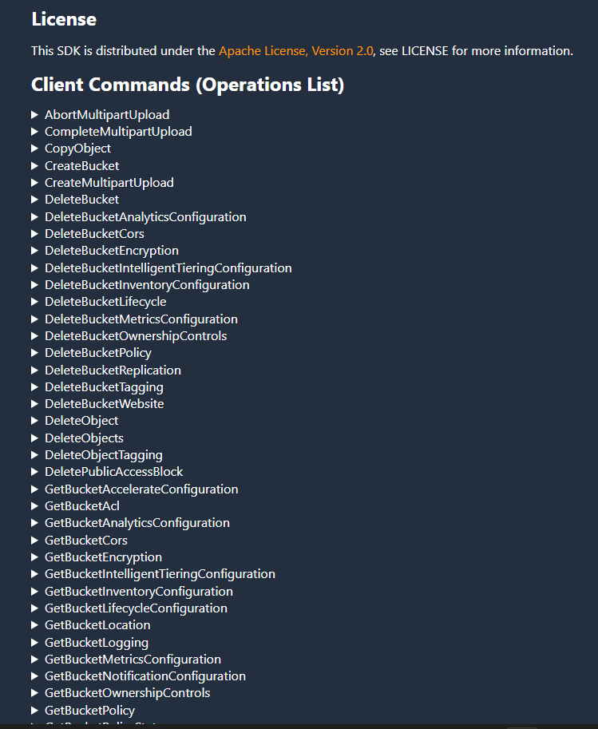
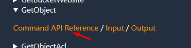
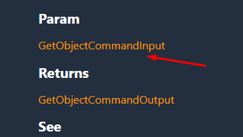
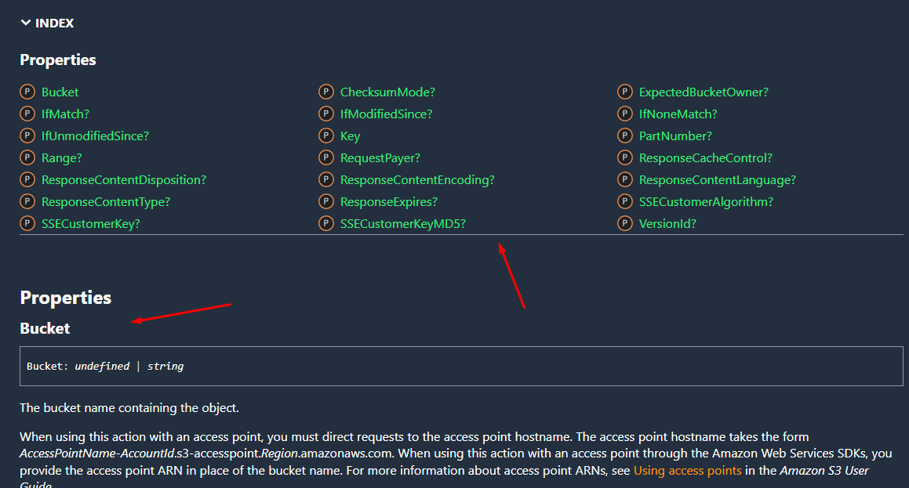

## ```Como se comunicar com os serviços da AWS```

<br>

```diff
+ Certifique-se de possuir o pacote do pkg-core em uma versão >= 3.0.0 instalado em seu serviço.
```


<br>

## Passo a passo

<br>

### Importar e instanciar o método AWS passando o serviço e configurações via parâmetro

<br>

(index.js)
```js
const { AWS } = require('pkg_core');
const factory = require('./factory');
const config = require('../../../../config');

const s3 = AWS({ serviceName: 'S3', config: { region: config.s3.region } });

module.exports = factory(s3);
```

**Parâmetros**: <br>

| Parâmetro | Tipo | Descrição |
| --- | --- | --- |
| ```serviceName``` | ```string``` | ```Nome do serviço a ser utilizado.```A lista de string válidas está abaixo. |
| ```config``` | ```object``` | ```Configurações necessárias para utilizar o serviço.``` É possivel encontrar na documentação. Exemplo: https://docs.aws.amazon.com/AWSJavaScriptSDK/v3/latest/clients/client-s3/interfaces/s3clientconfig.html |


```diff
Serviços disponíveis:

* SSM
* S3
* SQS
* SNS
* DynamoDB
* Lambda
* Firehose
* SES
* SESv2
* SFN
* Rekognition

- É importante utilizar as strings acima para encontrar o serviço corretamente.
```

**Erros comuns que podem ocorrer**: <br>

| Erro | Descrição |
| --- | --- |
| Service ${serviceName} not implemented! | Utilizar algum serviço da AWS que não possui instalado na pkg-core |


<br>

### Utilizar o método ``sendCommand``, passando o nome do comando e parâmetros necessários para enviar o comando. 

<br>

(factory.js)
```js
const factory = s3 => {
  const getFile = async ({ Bucket, Key }) => {
    try {
      return await s3.sendCommand({
        command: 'GetObject',
        params: {
          Bucket,
          Key,
        },
      });
    } catch (err) {
      if (err.Code === 'NoSuchKey') {
        return {};
      }

      throw err;
    }
  };

  return {
    getFile,
  };
};

module.exports = factory;
```

**Parâmetros**: <br>

| Parâmetro | Tipo | Descrição |
| --- | --- | --- |
| ```command``` | ```string``` | ```Nome do comando a ser utilizado.``` Para consultar os comandos disponíveis, utilize a documentação oficial da AWS SDK V3, Exemplo: https://docs.aws.amazon.com/AWSJavaScriptSDK/v3/latest/clients/client-s3/index.html - **Não é necessário enviar a string 'Command' junto ao comando.** |
| ```params``` | ```object``` | ```Parâmetros necessários para utilizar o comando.``` É possivel encontrar na documentação. Exemplo: https://docs.aws.amazon.com/AWSJavaScriptSDK/v3/latest/clients/client-s3/interfaces/getobjectcommandinput.html |

**Erros comuns que podem ocorrer**: <br>

| Erro | Descrição |
| --- | --- |
| Command ${commandName} not found for service ${serviceName} | Utilizar comando inexistente para o serviço informado  |

<br>
<br>


## ``Consultar os comandos e parâmetros disponíveis``

<br>

### Utilize a documentação oficial da AWS SDK V3, exemplo utilizando o S3:

<br>

https://docs.aws.amazon.com/AWSJavaScriptSDK/v3/latest/clients/client-s3/index.html

É possível visualizar todos os comandos disponíveis para utilizar no parâmetro ```command```:



### Acesse um comando:




### Na página do comando acessada, é possivel encontrar a seção de ```Param e os inputs do comando```



### É possível visualizar todos as propriedades disponíveis para utilizar no parâmetro ```params```:


